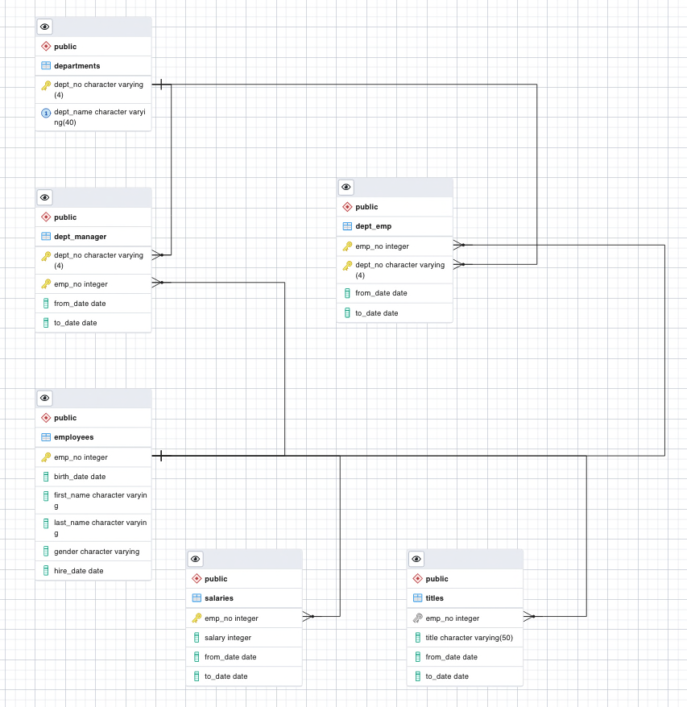
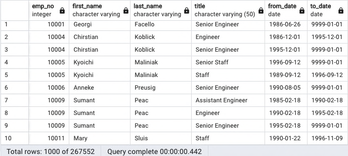
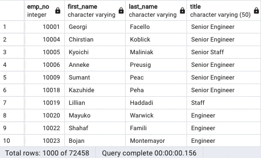
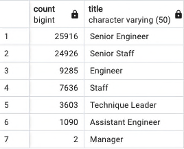
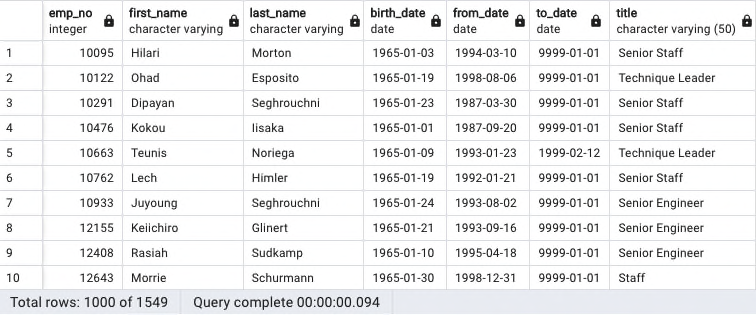
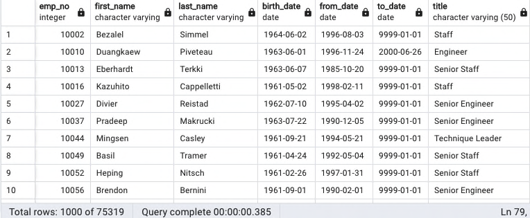

# Analysis Report Prepared for Pewlett Hackard
It has come to the attention of Pewlett Hackard executives that many baby boomers are retiring at a rapid rate. Bobby has been tasked to find out who many employees will be eligible for retirement in the next few years and which employees will be eligible to act as mentors to help prepare younger employees in their respective department for career advancement. 

## Overview
This analysis has 2 main objectives:

1) How many employees will be ready to retire in the next 3 years?
2) Which employees are eligible to be part of the mentorship program to prepare them as the next generation to take on these senior roles?

Pewlett Hackard (PH) is a huge company with a very large employee database.  Before we go over the results, please refer the the following ERD where we can see all of the currently existing tables and thier relationships to one another.

In the ERD, all tables connect to the employees table either directly or indirectly.  The employee table is the main table of the employee database and contains all the identifying information of an employee with keys to access any additional information where an employee will have 1 or more records.  This table is used to track every employee that works at PH. 

Going counter clockwise starting from the employees table we can see that each employee has 1 or more titles and 1 or more salaries over the years.  Titles and Salaries are kept in separate tables referencing the employees and dates that each employee had a specific Title and/or Salary.

Next, the departments table contains all the departments of the company by number and name. This table is connected to the 2 cross reference tables, dept_emp and dept_manager.

The dept_emp table is a cross reference table between Employees and Departments.  Since there is a many-to-many relationship between Employees and Departments, this cross reference table creates a one-to-one relationship between Departments and Employees via the emp_no and dept_no such that one employee will have one department based on the values in to_date and from_date fields that the employee worked in the specific department.

The dept_manager table is also a cross reference table between Employees and Departments. Similar to the the dept_emp table, this one also creates a one to one relationship between Employees and Departments, however, this one is for employees that are managers of the department vs. employees that are workers in the department.

## Results
To make it easier to distiguish the employees ready for retirement from the possible pool of employees to be mentored we will refer to these 2 groups as mentors and mentees going forward.

Major takeaways from this analysis include the following:
- The first run returned too many mentors and needed further filtering.
- The smaller sample still returned a very large pool of mentors but making it even smaller would remove them entirely from the pool.
- Looking at the roles that would be opening showed that more than 2/3rd of the mentors were in Senior roles.
- The pool of mentees requested by HR is entirely too small to cover the number of mentors that would be in the program.

### First Pool of Mentors
The first run through the data created a table of all the employees born between 1952 and 1955 for every role they held during their employment.  This list of employees turned out to have over 267.5K records as shown here:

### Smaller Pool of Mentors
Since this list included every title for each employee that ever worked at PH, the search was narrowed down to only include current employees and their current role. Even so, over 72K potential roles that need to be filled over the next few years is quite staggering. The following image shows a sampling of employees that will potentially be retiring and the roles that will be needed if everyone born between 1952 and 1955 were to retire:

### Number of Roles Opening Up as Mentors Retire
The number of mentor roles to be filled by mentees are shown in the table below ordered by the count of the roles by title:

We can see that roughly 2/3 are either Senior Engineers or Senior Staff members. If only Senior level positions needed to be filled that would be over 50k people. This group alone is a huge tsunami.

### Pool of Mentees Requested by HR
The table of employees that are eligible for mentorship using the original birthdate of 1965 is shown below:

In total, there are only 1,549 employees if we only take from the pool of employees born in 1965. This is barely enough to take over for the 2 roles with the least number employees out of the 7 roles that need to be filled.

## Summary
Overall, Pewlett Hackard has an extremely large pool of potential retirees and a very small pool of eligible mentors based on the 2 queries asked of us by the HR department. 

PH needs to move quickly to prepare for the "silver tsunami!"

### Query 1
#### How many roles will need to be filled?
Earlier we saw the number of roles that will be potentially opening up as the "Silver Tsunami" hits the doors. As we noted, more than 2/3rds are Senior roles. Later we will query for those mentors that may want to move into a more Senior position before retiring full-time.

### Query 2
#### Are there enough qualified, retirement-ready employees in the departments to mentor the next generation of Pewlett Hackard employees?

The number of potential retirees compared to the number of employees that were born in 1965 is too great to expect the retiring roles of over 72.5K employees to be filled by just 1.5K employees.  In order to get a reasonable number of employees to fill these roles we needed to expand our search to include birthdates starting in 1961 through 1965. This new search gave us a total of a little over 75K employees that would be eligible for mentorship into the roles that will be opening up over the next few years.

### Query 3
#### Which employees are in the pool of mentors but do not have senior roles?

Approximately, 1/3 of the mentor pool are not in senior roles.  It may be the case that a good portion of this pool will want to enter as a mentee to move into senior roles before retiring at a later date.  This could help PH fill in roles or some retirees where the current pool of mentees is still too small.

TODO: perform query and put image of output here

### Query 4
#### TODO: think of another possible query to add

TODO: add image of query results here

## Future Enhancements

Though we have completed that analysis asked for us by the HR department, there are a few enhancements that we suggest for the future as this type of analysis will likely be ongoing as people age out of their current status and into a new one or as they leave for any number of other reasons.

In general, younger, less experienced employees will be invaluable to replaceing the mentees as they age  out to become mentors themselves.  To make the match pairing easier, we suggest adding the following feaures:

1) Allow the user to enter start and end birth dates for both mentors and mentees and use them to find the list of mentees and mentors to be paired.
2) Allow the user to enter a specific department and use it to present lists of eligible mentors with mentees from the department requested.
3) Allow the user to enter a title for the mentor and a different title for the mentees. For example, Senior Engineer for the mentor and Engineer for the mentee.  
4) Create a new table in the database to hold additional info for Mentors and Mentees such as a reference to whom they are paired with, a boolean value indicating interest in the program, etc.
5) Develop an intuitive front end GUI to allow HR personel to easily perform these searches and modify entries as needed.
