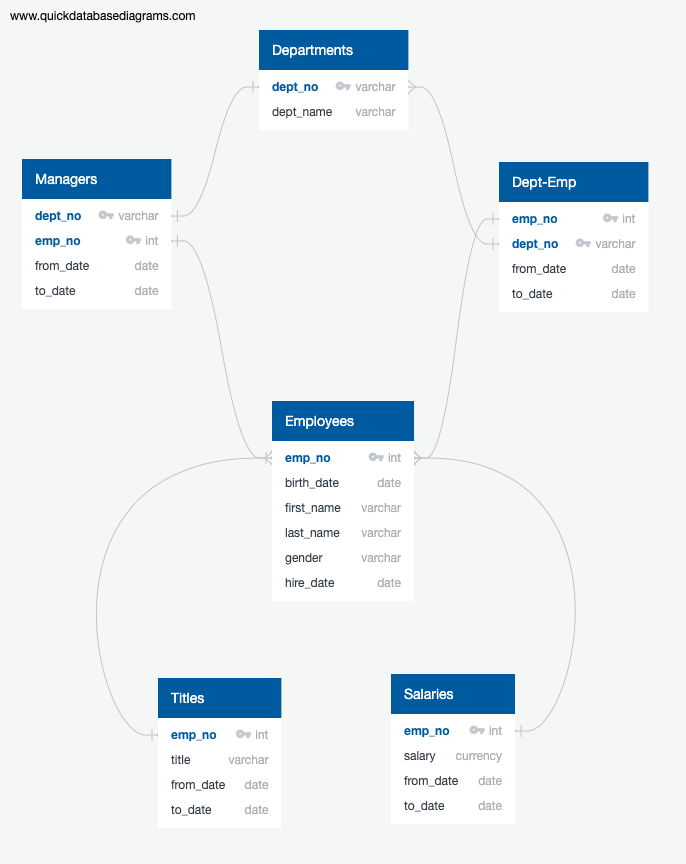
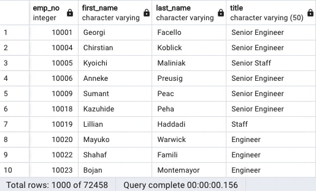

# Analysis Report Prepared for Pewlett Hackard
It has come to the attention of Pewlett Hackard executives that many baby boomers are retiring at a rapid rate. Bobby has been tasked to find out who many employees will be eligible for retirement in the next few years and which employees will be eligible to act as mentors to help prepare younger employees in their respective deparment for career advancement. 

## Overview
This analysis has 2 main objectives:

1) How many employees will be ready to retire in the next 3 years?
2) Which employees are eligible to be part of the mentorship program to prepare them as the next generation to take on these senior roles?

Pewlett Hackard (PH) is a huge company with a very large employee database.  Before we go over the results, please refer the the following ERD where we can see all of the currently existing tables and their relationships to one another.

In the ERD, we can easily see that the employees are the main table used to track every employee that is or has worked at PH. Each employee has 1 or more titles and 1 or more salaries over the years.  Titles and Salaries are kept in separate tables referencing the employees and dates that each employee had that Title and/or Salary.

As an employees of the company, the Managers table connects each manager with its respective employee record in a one-to-one relationship.  Similarly, each manager is connected to its respective department record which is also a one-to-one relationship for a specific date range. In other words, a manager can only be associated with one department at any given point in time.  There could be cases where a manager has worked for more than one department over the course of their career but they will only be associated with one of the them depending depending on the date being used to query for the manager's department info.

Finally, the Dept-Emp table is a cross reference table between Employees and Departments.  Since there is a many-to-many relationship between Employees and Departments, this cross reference table creates a one-to-many relationship from Dept-Emp to Employees via the emp_no and dept_no such that one employee will have several records in the Dept-Emp table... (TODO: See questions in slack to confirm these relationships.) 

## Results
Major takeaways from this analysis include the following:

- The first run through the data created a table of all the employees born between 1952 and 1955 for every role they held during their employment.  This list of employees turned out to have over 267.5 K records as shown here:

- Since this list included every title and employees that had already left the company, the search was narrowed down to only include current employees of PH and their current role. Even so, the potential number of roles that need to be filled over the next few years is quite staggaring. The following image shows each role and how many potential openings there are if everyone born between 1952 and 1955 were to retire:

- The number of roles to be filled by title are shown in the table below.

- The table of employees that are eligible for mentorship using the original birthdate of 1965 is shown below:

## Summary
TODO: Provide high-level responses to the following questions, then provide two additional queries or tables that may provide more insight into the upcoming "silver tsunami."

### How many roles will need to be filled as the "silver tsunami" begins to make an impact?
TODO: answer q

### Are there enough qualified, retirement-ready employees in the departments to mentor the next generation of Pewlett Hackard employees?

The number of potential retirees compared to the number of employees that were born in 1965 is too great to expect the retiring roles of over 72.5K employees to be filled by just 1.5K employees.  In order to get a reasonable number of employees to fill these roles we needed to expand our search to include birthdates starting in 1961 through 1965. This new search gave us a total of a little over 75K employees that would be eligible for mentorship into the roles that will be opening up over the next few years.

